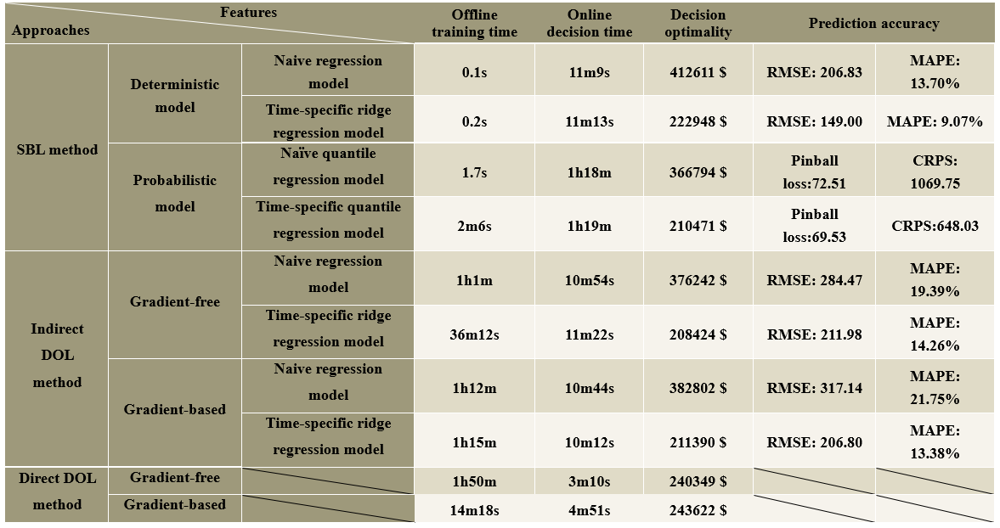

# Decision-Focused-Learning-Benchmarks
This repository contains the code for the paper Decision-Focused Learning for Power System Decision-Making under Uncertainty. We developed the benchmark model based on load forecasting for two-stage electricity generation scheduling in the IEEE 118-Bus system, a widely recognized test case. This work corresponds to the paper [Decision-Focused Learning for Power System Decision-Making under Uncertainty](https://arxiv.org/abs/2401.03680), where we elaborate on our methodology, implementation details, and experimental results.

Here, we compare the performance of six typical approaches from widely recognized papers: 

**a. Deterministic Approach: Point forecast（MLR）+ deterministic optimization [1,2].**

**b. Probabilistic Approach: Probabilistic forecast + uncertain optimization [3].**

**c. DFL Approach**: As suggested by other reviewers, the DFL methods are further categorized into four types based on direct/indirect, gradient based/gradient free. We select several baseline papers and replicated on our benchmark test case: **Indirect Gradient-Based Methods [4]**, **Indirect Gradient-Free Methods [5]**, **Direct Gradient-Based Methods**, and **Direct Gradient-Free Methods [6]**. At present, implementations for the first four approaches are publicly available, while the remaining two will be released in the near future. As demonstrated in Table I, the six baseline approaches are evaluated across four quantitative metrics and three qualitative metrics. So far, the implementation and quantitative evaluation of the direct gradient-based model approach on our dataset are ongoing, and the results will be included in future updates to the repository. We welcome contributions from the research community to collaboratively enrich the benchmark and promote shared progress.

Two pre-experimental remarks are made for this comparison analysis: 

**Remark I:** In consideration of the significant impact of forecasting model on decision performance, two sub-models are further evaluated for SBL method, probabilistic method, and indirect DOL methods as shown in Table III, namely a naïve regression model and a time-specific ridge regression model. The naïve model is a unified forecasting model trained for all time intervals as in [1] and the time-specific approach trains 24 distinct regression models (one per hour), effectively creating 24 surrogate functions as in [4]. L2 regularization is added to prevent overfitting [7].

**Remark II:** It is noted that the quantitative results might vary on different testing data sets, model selections and scenario parameters such as generation cost and renewable penetrations. The function of this open-source framework is to serve as an experiment platform and baseline case. Future works are encouraged to adjust the models and parameters in this comparison to test different methods.

**Fig. 1 Direct and indirect approaches to achieve decision-focused learning.** Decision-focused learning is a learning paradigm that trains ML models in a forecast-then-optimize framework with decision optimality as the ultimate goal. The indirect approach follows the process of forecasting first and then optimizing, explicitly generating forecasts, while the direct approach simplifies this process and does not explicitly generate forecasts.

Numerical results are concluded in Table I below.

**Table I Evaluate the potential of the four methods in six features**

References:

[1] T. Hong, P. Wang and H. L. Willis, “A Naïve multiple linear regression benchmark for short term load forecasting,” 2011 IEEE Power and Energy Society General Meeting, Detroit, MI, USA, 2011, pp. 1-6.

[2] Stoft, S. (2002). Power system economics: Designing markets for electricity. New York: John Wiley & Sons, IEEE Press.

[3] J. M. Morales, A. J. Conejo and J. Perez-Ruiz, “Economic valuation of reserves in power systems with high penetration of wind power,” IEEE Trans. Power Syst., vol. 24, no. 2, pp. 900-910, May 2009.

[4] Zhang, Jialun, Yi Wang, and Gabriela Hug. "Cost-oriented load forecasting." Electric Power Systems Research 205 (2022): 107723.

[5] J. M. Morales, M. Á. Muñoz, and S. Pineda, “Prescribing net demand for two-stage electricity generation scheduling,” Operations Research Perspectives, 2023, vol. 10, p. 100268.

[6] A. Stratigakos, S. Camal, A. Michiorri, and G. Kariniotakis, “Prescriptive trees for integrated forecasting and optimization applied in trading of renewable energy,” IEEE Trans. Power Syst., vol. 37, no. 6, pp. 46964708, 2022.

[7] Hoerl, Arthur E., and Robert W. Kennard. "Ridge regression: Biased estimation for nonorthogonal problems." Technometrics 12.1 (1970): 55-67.

